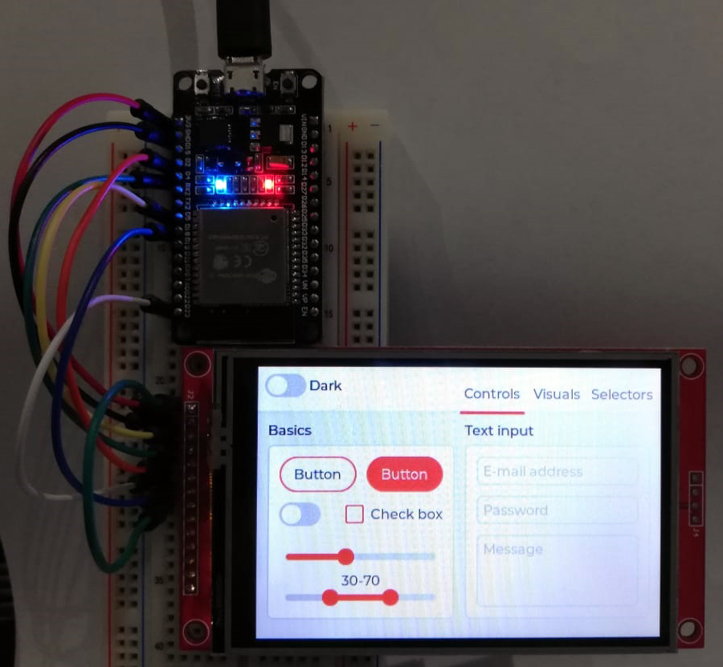

# Creat submodule

     git submodule add -b release/v7 https://github.com/littlevgl/lvgl.git components/lvgl/lvgl
     git submodule add -b release/v7 https://github.com/littlevgl/lv_examples.git components/lv_examples\lv_examples
     

# LVGL project for ESP32S2

This is an ESP32S2 demo project showcasing LVGL v7 with support for several display controllers and touch controllers.
The demo application is the demo_widgets project from the [lv_examples](https://github.com/lvgl/lv_examples) repository.

Version of LVGL used: 7.0.
Version of lv_examples used: 7.0.

Monochrome support:

# Supported display controllers:

## TFT

- ILI9341
- ILI9488
- ILI9486
- HX8357B/HX8357D
- ST7789
- ST7735S

## Monochrome

- SH1107
- SSD1306

## e-Paper

- IL3820
- UC8151D / GoodDisplay GDEW0154M10 DES
- FitiPower JD79653A / GoodDisplay GDEW0154M09

# Supported touchscreen controllers:

- XPT2046
- FT3236
- other FT6X36 or the FT6206 controllers should work as well (not tested)
- STMPE610